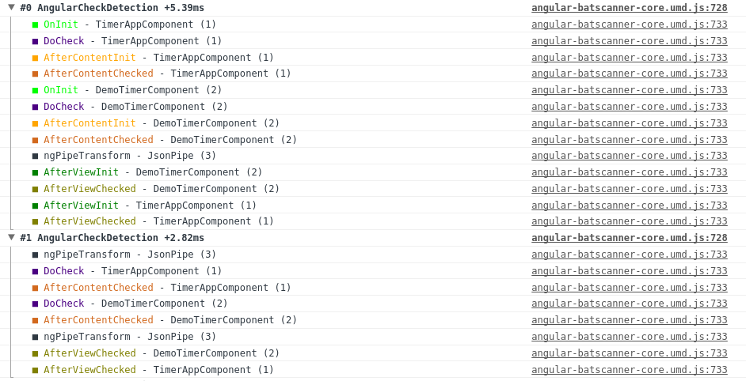
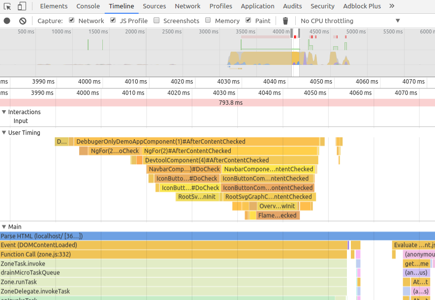
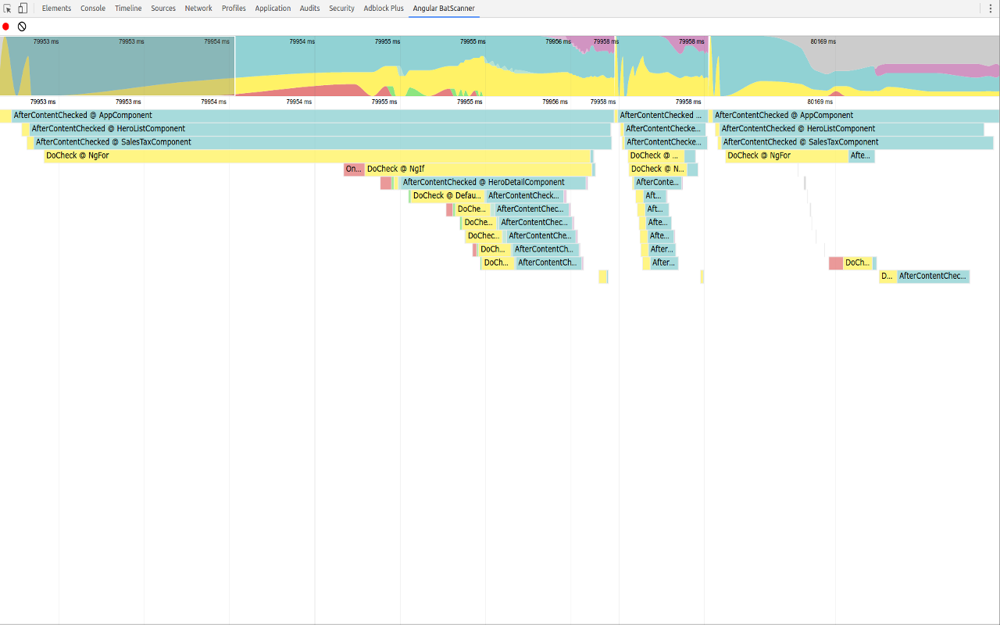

<p>
  <h1 align="center">angular-batscanner</h1>
</p>

<p align="center">
  

</p>

<p align="center">
  <a href="https://travis-ci.org/douglasduteil/angular-batscanner"></a>
  <a href="http://standardjs.com"></a>
  <a href="http://unmaintained.tech"></a>
</p>

## Packages 

### angular-batscanner-chrome

> The chrome extension

[](https://chrome.google.com/webstore/detail/angular-batscanner/gcngciildkejiapchdgpcniflijoiadf)


### angular-batscanner-core

> The core functionalities

[](https://npmjs.org/package/angular-batscanner-core)

### angular-batscanner-devtool

> The timeline devtool 

[](https://npmjs.org/package/angular-batscanner-devtool)

## Install

```sh
npm install angular-batscanner-core
```

You will need to replace the default `CompilerMetadataResolver` with 
`BatscannerCompilerMetadataResolver` to be able to extract the activity of the
all components at runtime.

## Usage

### Rainbow comsole



```js
import {
  BATSCANNER_PROVIDERS,
  BATSCANNER_ROOT_COMPONENT,
  BatscannerEventEmitter,
  BatscannerRainbowConsoleEmitter
} from 'angular-batscanner-core'

const compilerOptions = {
  providers: [
    BATSCANNER_PROVIDERS,
    {
      provide: BATSCANNER_ROOT_COMPONENT,
      useValue: TimerAppComponent
    },
    {
      provide: BatscannerEventEmitter,
      useClass: BatscannerRainbowConsoleEmitter,
      multi: true
    }
  ]
}

document.addEventListener('DOMContentLoaded', function () {
  ng.platformBrowserDynamic
    .platformBrowserDynamic()
    .bootstrapModule(AppModule, compilerOptions)
})
```

### Devtools performance marks



```js
import {
  BATSCANNER_PROVIDERS,
  BATSCANNER_ROOT_COMPONENT,
  BatscannerEventEmitter,

  BatscannerPerformanceMarkEmitter
} from 'angular-batscanner-core'

const compilerOptions = {
  providers: [
    BATSCANNER_PROVIDERS,
    {
      provide: BATSCANNER_ROOT_COMPONENT,
      useValue: TimerAppComponent
    },
    {
      provide: BatscannerEventEmitter,
      useClass: BatscannerPerformanceMarkEmitter,
      multi: true
    }
  ]
}

document.addEventListener('DOMContentLoaded', function () {
  ng.platformBrowserDynamic
    .platformBrowserDynamic()
    .bootstrapModule(AppModule, compilerOptions)
})
```

### Batscanner devtool



Install the [batscanner chrome devtool](https://chrome.google.com/webstore/detail/angular-batscanner/gcngciildkejiapchdgpcniflijoiadf)

```js
import {
  BATSCANNER_PROVIDERS,
  BATSCANNER_ROOT_COMPONENT,
  BatscannerEventEmitter,

  BatscannerWindowPostMessageEmitter
} from 'angular-batscanner-core'

const compilerOptions = {
  providers: [
    BATSCANNER_PROVIDERS,
    {
      provide: BATSCANNER_ROOT_COMPONENT,
      useValue: TimerAppComponent
    },
    {
      provide: BatscannerEventEmitter,
      useClass: BatscannerWindowPostMessageEmitter,
      multi: true
    }
  ]
}

document.addEventListener('DOMContentLoaded', function () {
  ng.platformBrowserDynamic
    .platformBrowserDynamic()
    .bootstrapModule(AppModule, compilerOptions)
})
```

Then open the devtool you should see a new tab named `Angular Batscanner` after 
you app started. Click on it ;)
The devtool is recording by default when it's open. You can go on using your app
and see on the devtool the Angular activity.


### All for them (because YOLO)

```js
const compilerOptions = {
  providers: [
    BATSCANNER_PROVIDERS,
    {
      provide: BATSCANNER_ROOT_COMPONENT,
      useValue: TimerAppComponent
    },
    {
      provide: BatscannerEventEmitter,
      useClass: BatscannerWindowPostMessageEmitter,
      multi: true
    },
    {
      provide: BatscannerEventEmitter,
      useClass: BatscannerRainbowConsoleEmitter,
      multi: true
    },
    {
      provide: BatscannerEventEmitter,
      useClass: BatscannerPerformanceMarkEmitter,
      multi: true
    }
  ]
}
```

## TODO

- Use standard version and conventional-github-releaser

<a href="https://github.com/conventional-changelog/standard-version"></a>

```sh
npm i -D standard-version conventional-github-releaser
```

## License

    Copyright © Douglas Duteil <douglasduteil@gmail.com>
    This work is free. You can redistribute it and/or modify it under the
    terms of the Do What The Fuck You Want To Public License, Version 2,
    as published by Sam Hocevar. See the LICENCE file for more details.
